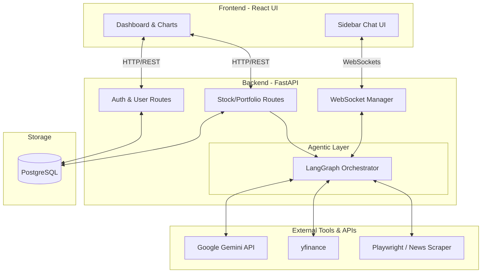
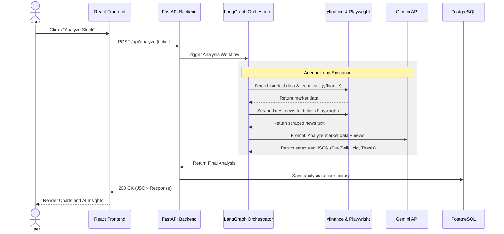

## Prompt 1

I want to build an app in python backend and react front end for stock analysis and buy/sell suggestions based on latest news and technical analysis. For stock related information I want to start of by using yahoo finance first. The UI will allow user to log in, register stocks, provide in-depth analysis by using information from yahoo stocks and news and processed by Gemini. So Gemini will have access to free tools that it may need to perform its analysis, like data from yahoo finance, playwright etc. Use framework like langgraph but you may choose any other framework that may be better suited for this. The app will also search for stocks which have a large potential gains in the short and long term. The app will ask the user to  select companies and or domains in which they want to perform the search. It will also have a sidebar chat which will be connected to Gemini for discussing more on the recommendations. The app will be finally hosted on Azure and the deployment will happen via terraform.

Given these requirements, can you come up with the steps that are required to build an app like this. Start with basic - like let's start with the high level design and the individual components.

This sounds like a fantastic and highly capable project. Combining traditional financial data with an LLM's reasoning capabilities via an agentic framework like LangGraph is exactly the right approach for a modern stock analysis tool.

FastAPI is highly recommended for the Python backend because of its native asynchronous support, which is critical when running LLM calls, web scraping (Playwright), and web sockets (for your sidebar chat).

Here is a breakdown of the High-Level Design (HLD) and the foundational steps to bring this application to life.

### 1. High-Level Design (HLD): The Core Components

To keep the system modular, scalable, and easy to deploy on Azure, we should divide it into four main pillars:

* **The Frontend (Client Layer):**
* **Framework:** React (bootstrapped with Vite for speed).
* **State & Routing:** React Router for navigation, and Context API or Zustand for state management (user sessions, current stock being viewed).
* **UI Components:** A library like Tailwind CSS + shadcn/ui for clean, dashboard-style aesthetics.
* **Real-time Communication:** WebSockets or Server-Sent Events (SSE) to handle the streaming responses for the Gemini sidebar chat.

* **The Backend (API Layer):**
* **Framework:** Python with FastAPI. It’s fast, modern, and handles the asynchronous operations required by LangGraph and Playwright beautifully.
* **Authentication:** JWT (JSON Web Tokens) for secure user login.
* **Database:** PostgreSQL (hosted on Azure) to store user credentials, registered stocks (watchlists), and chat history.

* **The AI & Agent Layer (The "Brain"):**
* **Orchestrator:** LangGraph. This is perfect because stock analysis is often cyclical (fetch data $\rightarrow$ check if sufficient $\rightarrow$ scrape news if needed $\rightarrow$ analyze).
* **LLM:** Google Gemini API. It handles the reasoning, parsing of news sentiment, and generating buy/sell suggestions based on your rules.
* **Tools:** * `yfinance` for historical data, current prices, and technical indicators.
* `Playwright` for scraping dynamic financial news sites or specific domain searches.

* **Infrastructure & Deployment (Azure + Terraform):**
* **Hosting:** Azure Container Apps or Azure App Service for both the React frontend and FastAPI backend.
* **Database:** Azure Database for PostgreSQL.
* **IaC:** Terraform to provision the resource groups, database, App Services, and securely inject environment variables (like your Gemini API key).

---

### 2. Step-by-Step Development Plan

Building this requires a phased approach so you can test the AI reasoning before dealing with complex UI or deployment infrastructure.

#### Phase 1: Foundation & Data Modeling

1. **Repository Setup:** Create a monorepo or two separate repositories (frontend/backend).
2. **Database Design:** Outline your schemas. You will need tables for `Users`, `Portfolios` (the stocks/domains they registered), and `ChatSessions`.
3. **Basic Backend:** Stand up a skeleton FastAPI app with basic CRUD routes for users and portfolios. Implement JWT authentication.
4. **Basic Frontend:** Set up the React app with a login screen and a simple dashboard that fetches the user's saved stocks.

#### Phase 2: The Agentic Core (LangGraph + Gemini)

*This is the most critical phase where the actual value of your app is created.*

1. **Tool Creation:** Write Python functions to fetch data. Create a `get_stock_data(ticker)` using `yfinance` and a `scrape_latest_news(ticker, domain)` using Playwright.
2. **Graph Construction:** Build your LangGraph workflow.
* *Node 1:* Fetch financial metrics (e.g., analyzing tech stocks like Google, pulling P/E ratio, moving averages).
* *Node 2:* Fetch current news.
* *Node 3 (Gemini):* Synthesize the data and output a structured JSON response with a "Buy/Hold/Sell" rating, a confidence score, and a short thesis.

3. **Search Logic:** Implement the feature where users can scan specific domains/sectors for high-potential gains by combining sector-wide APIs with Gemini's filtering.

#### Phase 3: UI Integration

1. **Dashboard UI:** Build the views where users can register stocks and trigger the "In-Depth Analysis".
2. **Data Visualization:** Integrate a charting library (like Recharts or Lightweight Charts) to display the `yfinance` historical data alongside the Gemini-generated analysis.

#### Phase 4: The Sidebar Chat

1. **WebSocket Setup:** Create a WebSocket endpoint in FastAPI to handle real-time chat.
2. **Contextual Memory:** Configure LangChain/LangGraph memory so the Gemini chat agent knows what stock the user is currently looking at on their screen.
3. **React Sidebar:** Build a persistent sidebar component that sends messages to the WebSocket and streams Gemini's response back to the user.

#### Phase 5: Infrastructure as Code & Deployment

1. **Dockerization:** Write Dockerfiles for both the React frontend (usually served via Nginx) and the FastAPI backend.
2. **Terraform:** Write the `.tf` files to define your Azure Resource Group, PostgreSQL server, and Azure Container Apps/App Service.
3. **Deployment:** Run your Terraform apply, push your containers to Azure Container Registry, and launch the app.

---

Would you like me to sketch out the specific database schema for this, or would you prefer to dive straight into designing the LangGraph nodes for the stock analysis workflow?

## Prompt 2
Can you add 2 additional things to this - the entire app should run locally and will be tested locally before finally being pushed to Azure. Also, on Azure we want to have 2 separate environment - test and prod.

These are excellent additions. Ensuring the application runs entirely locally guarantees a tight developer feedback loop without incurring cloud costs, and establishing distinct `test` and `prod` environments is a fundamental best practice for reliable software delivery.

Here is how we integrate these requirements into the architecture and development plan.

### 1. Enabling Seamless Local Development

To run the entire stack locally and mimic the eventual Azure environment as closely as possible, we will use **Docker Compose**.

* **The `docker-compose.yml` file:** This will orchestrate your entire local setup with a single command (`docker-compose up`). It will define three primary services:
1. **Frontend Service:** Your React/Vite app with hot-reloading enabled.
2. **Backend Service:** Your FastAPI/Python app. We will configure it to mount your local code directory so changes reflect instantly without rebuilding the container.
3. **Database Service:** A local PostgreSQL container.

* **Environment Variables:** You will use a local `.env` file (which is strictly ignored by git) to securely store your Gemini API key, local database credentials, and Playwright configuration.
* **Local Playwright:** The FastAPI Dockerfile will need a step to install Playwright's browser binaries so the scraping tools work seamlessly inside the local container.

### 2. Architecting Test and Prod on Azure via Terraform

To manage two distinct environments without duplicating your infrastructure code, we will make your Terraform configuration modular.

* **Terraform Workspaces or Variable Files:** Instead of hardcoding Azure resource names, your Terraform scripts will use variables. You will have a `test.tfvars` file and a `prod.tfvars` file.
* **Azure Isolation:** * **Test Environment:** Deployed into a dedicated Azure Resource Group (e.g., `rg-stockapp-test`). It will use smaller, cheaper compute instances (Azure Container Apps/App Service) and a basic PostgreSQL tier. This is where you verify your Gemini prompts and LangGraph flows work with actual Azure networking.
* **Prod Environment:** Deployed into a separate Resource Group (e.g., `rg-stockapp-prod`). This ensures absolute isolation. If you accidentally drop a database table in `test`, `prod` remains untouched. It will use production-grade compute and database tiers.

* **CI/CD Pipeline (e.g., GitHub Actions):** You will set up a pipeline that automates this flow:
* Merging code to the `main` branch automatically builds the Docker images, runs Terraform with `test.tfvars`, and deploys to the Test environment.
* After manual verification, a manual trigger promotes those exact same Docker images to the Prod environment using `prod.tfvars`.

### 3. Updated Step-by-Step Plan

Here is how these requirements modify our previous development phases:

* **Phase 1: Foundation & Local Containerization**
* Set up React and FastAPI.
* **NEW:** Write the `Dockerfile` for each and a `docker-compose.yml` to spin up both along with a local PostgreSQL container. Ensure everything runs via `localhost`.

* **Phase 2 & 3: Agent Core & UI Integration**
* Build the LangGraph agents, integrate Gemini and yfinance, and build the UI.
* *All testing happens locally in the Docker Compose environment.*

* **Phase 4: Infrastructure as Code (Terraform)**
* Write the Terraform configuration (`.tf` files).
* **NEW:** Parameterize the Terraform code. Create `test.tfvars` (cheaper resources) and `prod.tfvars` (production resources).

* **Phase 5: CI/CD Pipeline & Deployment**
* **NEW:** Create a GitHub Actions workflow (or Azure DevOps pipeline).
* Configure it to deploy to the Azure `test` environment on every code merge.
* Add a manual approval gate to deploy to the Azure `prod` environment.

---

Would you like to start by drafting the `docker-compose.yml` file to get your local environment stubbed out, or would you prefer to look at how we should structure the Terraform directories for the test and prod environments?

## Prompt 3
Can you start with high level ump diagrams highlighting the design of the system? What are the different components and how they interact

Here are the high-level UML diagrams representing the logical architecture and the interaction flow of your system. To make these easy to read and integrate into your documentation, I have used Mermaid.js syntax, which generates standard UML diagrams.

### 1. Component Diagram: System Architecture

This diagram illustrates the structural design of the system, showing the distinct modules and how they connect.

**Key Interactions:**

* **Frontend to Backend:** The React app uses standard HTTP REST calls for CRUD operations (registering stocks, logging in) and a persistent WebSocket connection for the Gemini sidebar chat.
* **Backend to Database:** FastAPI handles reading and writing user profiles, saved stock lists, and historical chat logs to PostgreSQL.
* **Backend to Agent:** When a user requests an analysis or sends a chat message, FastAPI hands the request off to the LangGraph Orchestrator.
* **Agent to External World:** LangGraph determines the execution path. It calls `yfinance` for quantitative data, triggers Playwright to scrape qualitative news, and feeds all that context to the Gemini API for synthesis.

---

### 2. Sequence Diagram: In-Depth Stock Analysis Flow

This diagram traces the step-by-step execution path when a user requests an analysis for a specific stock or sector.

**Key Takeaways from the Flow:**

1. **Asynchronous Nature:** The Agentic Loop block can take a few seconds (fetching data, scraping, waiting for the LLM). FastAPI's asynchronous nature (`async def`) ensures the server doesn't block other users while this happens.
2. **Stateless Agent, Stateful Backend:** LangGraph performs the heavy lifting and reasoning, but the FastAPI backend is responsible for taking the final output and persisting it to PostgreSQL before sending it back to the client.

---

### 3. Deployment Context (Local vs. Azure)

While not a standard UML diagram, it is important to map how these components sit in your environments:

* **Locally:** The React App, FastAPI App, and PostgreSQL DB all run in separate Docker containers managed by `docker-compose`. They communicate over a custom Docker bridge network.
* **On Azure (Test/Prod):** The Docker containers for React and FastAPI are pushed to an Azure Container Registry and hosted on Azure Container Apps. PostgreSQL is hosted on Azure Database for PostgreSQL (Flexible Server). Terraform manages the networking (VNet, subnets) that allows them to communicate securely.

Would you like to move on to defining the specific API endpoints (REST routes and WebSocket channels) between the React frontend and FastAPI backend, or would you prefer to start designing the database schema?